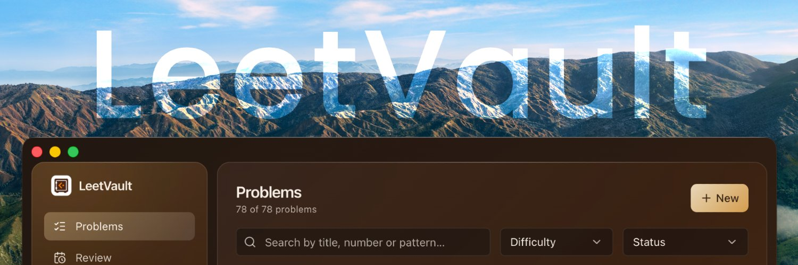

  

Welcome to **LeetVault**, the local desktop application designed to supercharge your LeetCode problem-solving journey.

*Developed by Francisco Sánchez de León Acevedo*

### What is LeetVault?
LeetVault is a standalone desktop companion that tracks, manages, and optimizes your LeetCode practice. Instead of relying on manual spreadsheets or third-party cloud trackers, LeetVault runs completely locally. It pairs with a browser extension, capturing your completed problems and submissions in real-time, right from your browser, while keeping your data entirely in your own hands.

### Key Functionalities
* **Browser Integration:** Runs a lightweight local server (`localhost:7842`) to catch submissions sent from the LeetVault browser extension.
* **Spaced Repetition Learning:** Implements the SM-2 spaced repetition algorithm to review at the optimal time, to practice study.
* **100% Local & Private:** Your progress is stored locally in a SQLite database (`leetcode.db`). No accounts, no cloud syncs, no subscription fees. 
* **True Cross-Platform:** Available and natively optimized for Windows, macOS (x64 & Apple Silicon), and Linux (AppImage & deb). It smartly migrates and manages your database location based on your OS.
* **AI Interviewer:** Link your AI API (stored locally) to practice coding live interviews, selecting language, difficulty, duration and the voice of your interviewer. Ask him clarifying questions, solutions, and get evaluated at the end.
* **Roadmaps:** Follow many integrated roadmaps such as NeetCode 150 or Blind 75 and keep track for all of them, getting redirected to each problem in the LeetCode website.

---

### Tech Stack
* **Core & Windowing:** Electron
* **UI Interface:** React + Vite (for lightning-fast HMR)
* **Language:** End-to-end TypeScript
* **Database:** `better-sqlite3`
* **Testing:** Vitest
* **Packaging:** `electron-builder` (NSIS, DMG, AppImage)

*For developer setup, build scripts, and local environment configurations, please see the [/docs](./docs) folder.*

---

## How to install

LeetVault installers aren't code-signed (code-signing certs cost $99–400/year). Your OS will warn you the first time. It's safe to bypass — here's how:

### Windows
When SmartScreen shows "Windows protected your PC":
1. Click **More info**
2. Click **Run anyway**

### macOS
If you see "LeetVault is damaged and can't be opened" or "cannot be opened because the developer cannot be verified":
1. Open **Terminal**
2. Run: `xattr -cr /Applications/LeetVault.app`
3. Launch the app normally

Alternatively: right-click the app → **Open** → **Open** in the dialog (works only for the "unverified developer" warning, not the "damaged" one).

### Linux
No warnings — AppImage and `.deb` just work.
